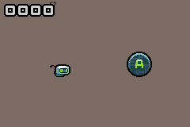

# GBA Jam 2022 - Flappy Bot

This game began as a way to learn C and homebrew GBA development.

Some sections of the code are heavily inspired by the Tonc library but it is mostly hand-written.

## Building

This game requires the DevkitARM toolchain in order to build
